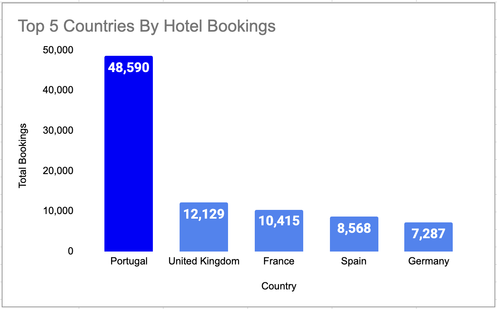
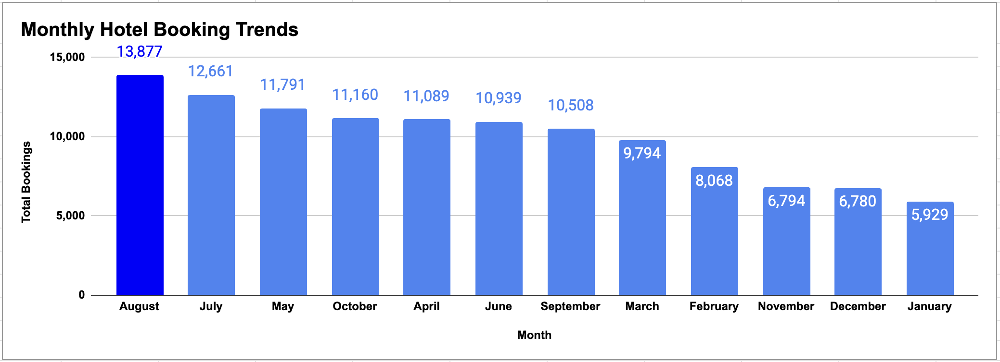
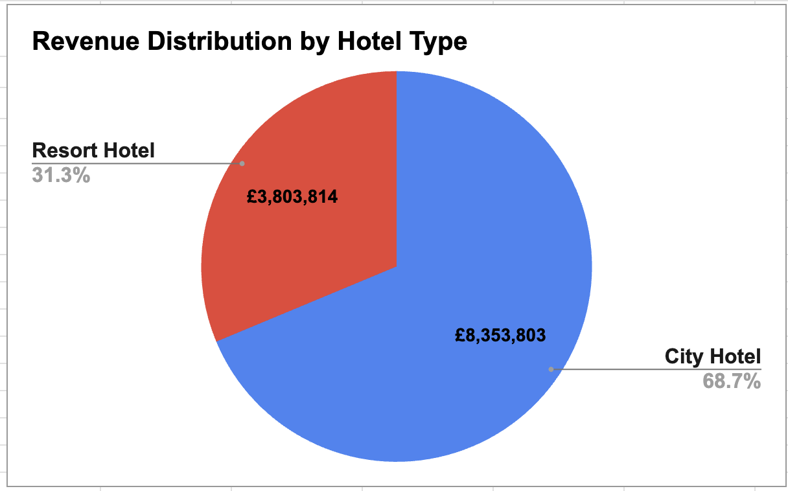
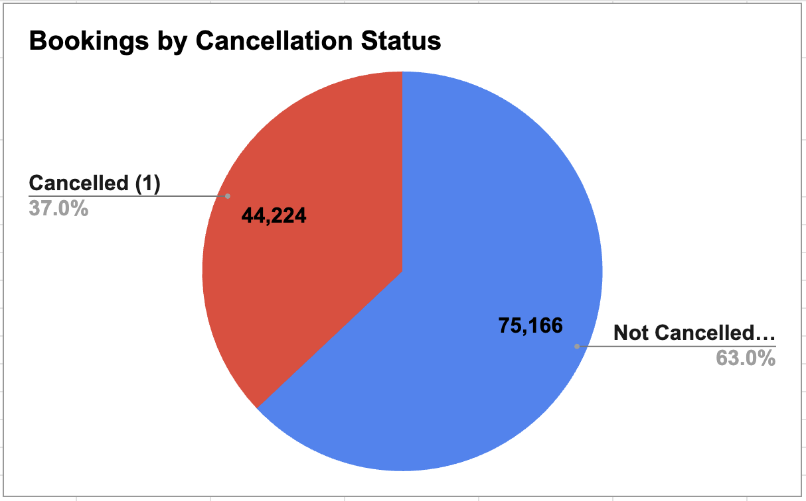
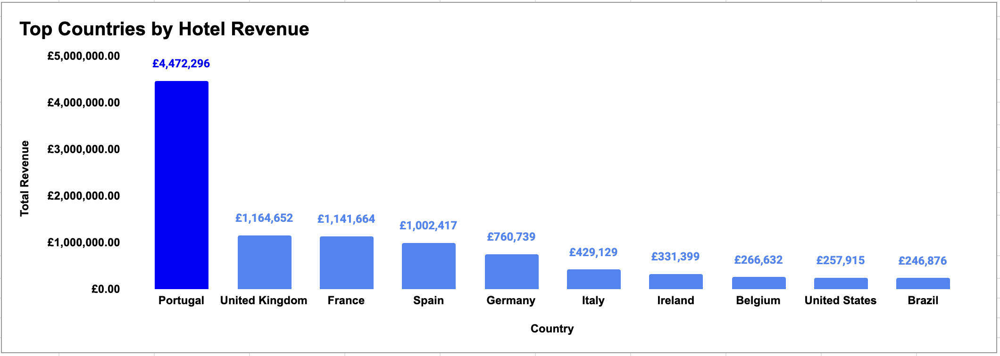

# Hotel Booking Demand Analysis

## Project Overview
This project analyzes hotel booking demand patterns using a dataset of over 119,000 hotel reservations.  
The objective is to identify key tourism trends, revenue drivers, cancellation patterns, and guest stay behavior.

---

## Top Countries by Hotel Bookings

Insight: Portugal dominates bookings due to strong domestic demand.

---

## Monthly Booking Trends

Insight: Hotel demand peaks during July and August.

---

## Revenue by Hotel Type

Insight: City Hotels generate roughly 70% of total revenue.

---

## Booking Cancellation Rate

Insight: Approximately 37% of bookings are cancelled.

---

## Revenue by Country

Insight: Portugal, UK, France, Spain, and Germany drive the majority of revenue.
